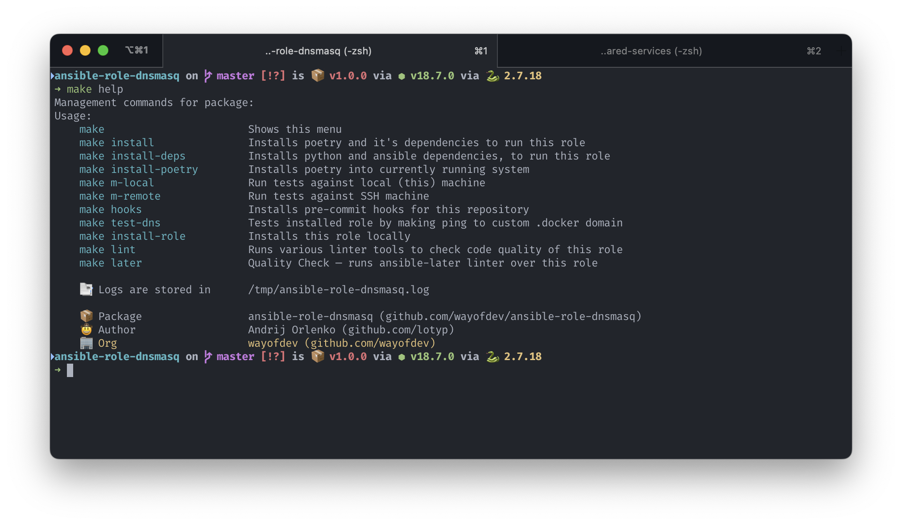

<br>

<div align="center">


</div>


<br>

<br>

<div align="center">
<a href="https://actions-badge.atrox.dev/wayofdev/ansible-role-dnsmasq/goto"></a>
<a href="https://galaxy.ansible.com/wayofdev/dnsmasq"></a>
<a href="https://github.com/wayofdev/ansible-role-dnsmasq/tags"></a>
<a href="https://galaxy.ansible.com/wayofdev/dnsmasq"></a>
<a href="https://galaxy.ansible.com/wayofdev/dnsmasq"></a>
<a href="LICENSE"></a>
<a href="#"></a>
</div>


<br>

# Ansible Role: Dnsmasq for MacOS



Role is used to automate installation and setup of [dnsmasq](https://thekelleys.org.uk/dnsmasq/doc.html). Dnsmasq provides network infrastructure for small networks: DNS, DHCP, router advertisement and network boot.

By default, role configures Dnsmasq to serve `*.docker` and `*.mac` domains as `localhost`. This allows you to use wildcard domains, like `your.subdomain.project.docker` for every of your project.

### → Purpose

Developers will be familiar with the process of updating your `/etc/hosts` file to direct traffic for `yourproject.docker` to `127.0.0.1`. Most will also be familiar with the problems of this approach:

- it requires a configuration change every time you add or remove a project; and
- it requires administration access to make the change.

For ***nix** and **MacOS** users there is a solution – **Dnsmasq**, which replaces the need for you, to edit the hosts file for each project you work with. Dnsmasq works good together with [Træfik](https://traefik.io/) and **Docker**.

There is a known issue with [Docker for Mac](https://www.docker.com/docker-mac) – "[.localhost DNS doesn’t resolve in browsers other than Chrome](https://forums.docker.com/t/localhost-dns-doesnt-resolve-in-browsers-other-than-chrome/16300)". Users who are working on Windows and using WSL or without it, will also have problems to get wildcard domains like `my.virtual.host.docker` working. For them, there is other thread and solutions described on [superuser.com](https://superuser.com/questions/135595/using-wildcards-in-names-in-windows-hosts-file).

<br>

If you **like/use** this role, please consider **starring** it. Thanks!

<br>

## 📑 Requirements

* Up-to-date version of ansible. During maintenance/development, we stick to ansible versions and will use new features if they are available (and update `meta/main.yml` for the minimum version).
* Compatible OS. See [compatibility](#-compatibility) table.
* `jmespath` library needs to be installed on the host running the playbook (needed for the `json_query` filter).
* Role has dependencies on third-party roles on different operating systems. See `requirements.yml` and [dependencies](#-dependencies) section.

<br>

## 🔧 Role Variables

Available variables are listed below, along with example values (see `defaults/main.yml`). Additional variables are stored in `vars/main.yml`.

### → Structure

Add domain names that will be mapped to ip addresses. Defaults should be fine, if you are using our wayofdev/mac-provisioner playbook:

```yaml
dnsmasq_hosts:
  # Mapping some top level domains to localhost
  - {domain: 'docker', ip: '127.0.0.1'}
  - {domain: 'mac', ip: '127.0.0.1'}
```

<br>

## 📗 Example Playbook

```yaml
---
- hosts: all

  # is needed when running over SSH
  environment:
    - PATH: "/usr/local/bin:/usr/local/sbin:/opt/homebrew/bin:{{ ansible_env.PATH }}"

  vars:
    dnsmasq_hosts:
      - {domain: 'docker', ip: '127.0.0.1'}
      - {domain: 'mac', ip: '127.0.0.1'}

  roles:
    - wayofdev.homebrew
    - wayofdev.dnsmasq
```

<br>

## ⚙️ Development

To install dependencies and start development you can check contents of our `Makefile`

**Install** [poetry](https://github.com/python-poetry/poetry) using [poetry-bin](https://github.com/gi0baro/poetry-bin) and all dev python dependencies:

```bash
$ make install
```

**Install** only python dependencies, assuming that you already have poetry:

```bash
$ make install-deps
```

**Install** all git hooks:

```bash
$ make hooks
```

**Lint** all role files:

```bash
$ make lint
```

<br>

## 🧪 Testing

You can check `Makefile` to get full list of commands for remote and local testing. For local testing you can use these comands to test whole role or separate tasks:

### → on localhost

> :warning: **Notice**: By defaut all tests are running against your local machine!

```bash
# run molecule tests on localhost
$ poetry run molecule test --scenario-name defaults-restored-on-localhost -- -vvv

# or with make command
$ make m-local

# choose which tags will be included
$ export TASK_TAGS="dnsmasq-install,dnsmasq-configure"; make m-local
```

<br>

### → over SSH

```bash
# run molecule scenarios against remote machines over SSH
# this will need VM setup and configuration
$ poetry run molecule test --scenario-name defaults-restored-over-ssh -- -vvv

$ make m-remote

# tags also can be passed
$ export TASK_TAGS="dnsmasq-install,dnsmasq-configure"
$ make m-remote
```

<br>

## 📦 Dependencies

Installation handled by `Makefile` and requirements are defined in `requirements.yml`

  - [wayofdev.homebrew](https://github.com/wayofdev/ansible-role-homebrew) - soft dependency, required if Homebrew isn't installed yet
  - [ansible.community.general](https://docs.ansible.com/ansible/latest/collections/community/general/index.html)

<br>

## 🧩 Compatibility

This role has been tested on these systems:

| system / container | tag      |
| :----------------- | -------- |
| macos              | monterey |
| macos              | big-sur  |

<br>

## 🤝 License

[](./LICENSE)

<br>

## 🙆🏼‍♂️ Author Information

This role was created in **2022** by [lotyp / wayofdev](https://github.com/wayofdev).

<br>

## 🧱 Credits and Resources

**What I've found on internet:**

* [robertdebock/ansible-role-dnsmasq](https://github.com/robertdebock/ansible-role-dnsmasq) ansible role to manage dnsmasq on Alpine, Debian, Fedora, Ubuntu...
* Also Debian/Ubuntu users can take a look at [Debops](https://galaxy.ansible.com/debops/)'s [Dnsmasq role](https://galaxy.ansible.com/debops/dnsmasq/).
* An Ansible role for managing Dnsmasq on RHEL/CentOS 7 of Fedora. [bertvv/ansible-dnsmasq](https://github.com/bertvv/ansible-dnsmasq)

<br>

## 🫡 Contributors


<a href="https://github.com/wayofdev/ansible-role-dock/graphs/contributors">
  
</a>

<br>
